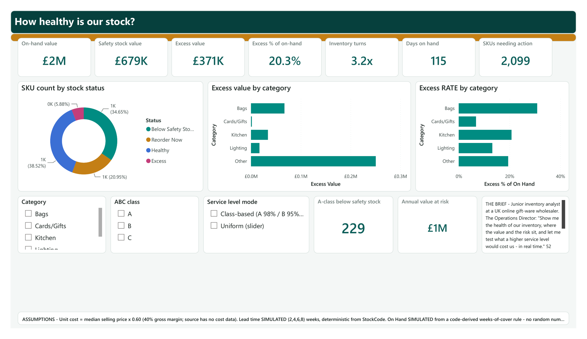
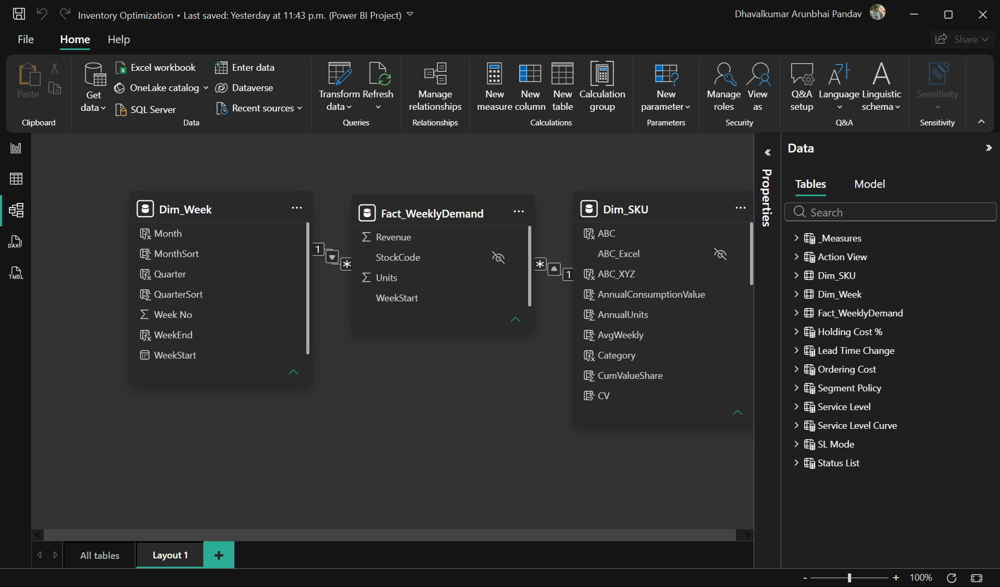
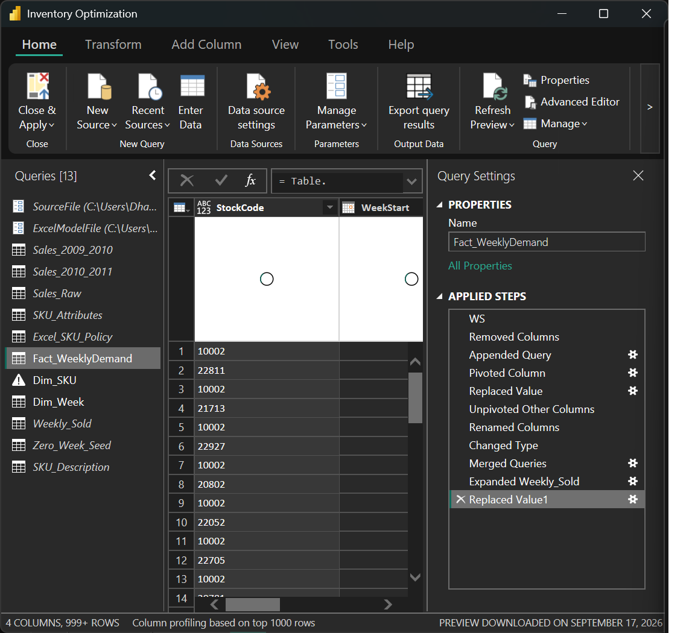
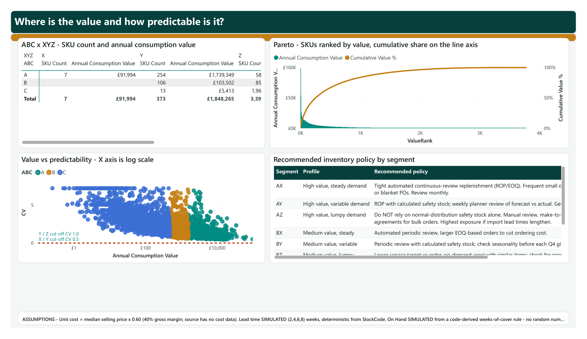
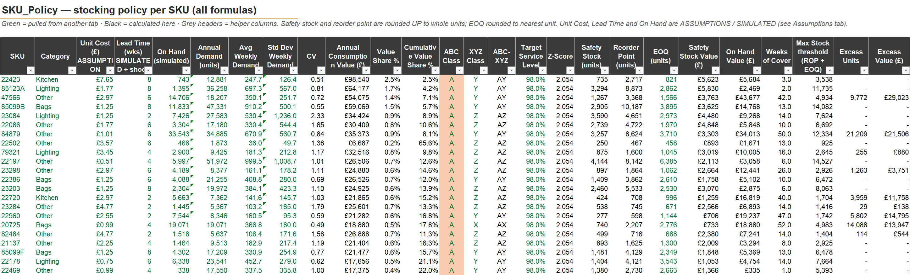
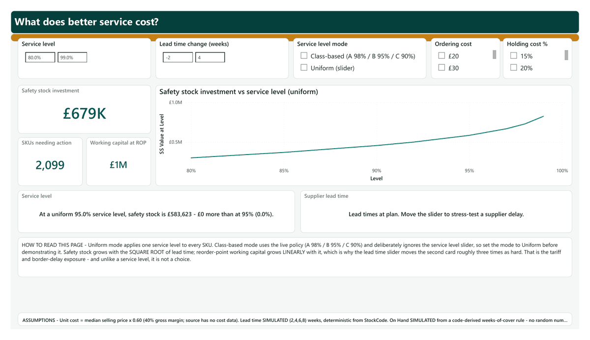
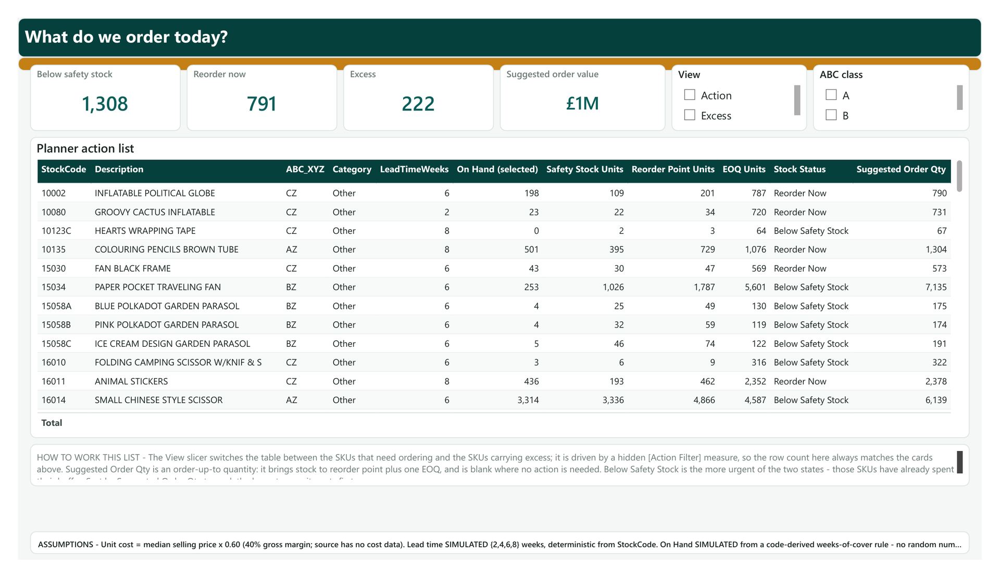

# Inventory Optimization: ABC-XYZ Analysis & Inventory Policy Simulator

**A SKU-level stocking policy for a 3,775-item wholesale portfolio - built in Excel and Power BI on 1.07 million real transaction lines, with a what-if simulator that prices the cost of service.**


<!-- SCREENSHOT: images/01_inventory_health.png - hero image, Power BI Page 1 -->


---

## Table of Contents

| | | |
|---|---|---|
| [Executive Summary](#executive-summary) | [Data Model Overview](#data-model-overview) | [Key KPIs](#key-kpis) |
| [Business Problem](#business-problem) | [Power Query Transformations](#power-query-transformations) | [Business Insights](#business-insights) |
| [Project Objectives](#project-objectives) | [ABC Analysis Methodology](#abc-analysis-methodology) | [Recommendations](#recommendations) |
| [Dataset Overview](#dataset-overview) | [XYZ Analysis Methodology](#xyz-analysis-methodology) | [Validation](#validation-approach) |
| [Inventory Segmentation Matrix](#inventory-segmentation-matrix) | [Inventory Optimization Logic](#inventory-optimization-logic) | [Assumptions & Limitations](#assumptions--limitations) |
| [Service Level Strategy](#service-level-strategy) | [Dashboard Pages](#dashboard-pages) | [Technology Stack](#technology-stack) |
| [Repository Structure](#repository-structure) | [Screenshots](#screenshots) | [Future Enhancements](#future-enhancements) |

---

## Executive Summary

A UK online gift and homeware wholesaler was carrying stock it could not sell while running out of its best sellers. There was no stocking rule anywhere in the business: no reorder points, no safety stock logic, no segmentation, and no way to answer the Operations Director's question - *"what does it cost us to go from 95% service to 99%?"*

This project builds that missing policy layer from the company's own transaction history. 1,067,371 invoice lines across two years were cleaned in Power Query down to a 3,775 SKU × 52 week demand grid (196,300 rows), classified by value (ABC) and demand predictability (XYZ), and turned into a per-SKU policy of safety stock, reorder point and economic order quantity. An Excel workbook holds the transparent, auditable version of the model; a Power BI report (five analysis pages plus a reconciliation page) makes it interactive, with what-if sliders for service level, lead time, ordering cost and holding cost.

**Headline result - full 3,775-SKU portfolio, at the default class-based service policy (A 98% / B 95% / C 90%):**

| KPI | Value |
|---|---|
| Simulated on-hand inventory value | £2.0M |
| Safety stock investment implied by policy | £679K |
| Excess inventory above max stock level | £371K (20.3% of on hand) |
| Inventory turns | 3.2x |
| Days on hand | 115 |
| SKUs requiring planner action today | 2,099 of 3,775 (55.6%) |

**The finding that changed the recommendation:** only 7 SKUs out of 3,775 (0.19%) qualify as X-class - demand steady enough (CV ≤ 0.5) for a classical reorder-point formula to be trusted unattended. 51% of all SKU-weeks are zero-demand weeks. Most of this catalogue has intermittent demand. The deliverable is therefore not "automate reordering"; it is *automate the 7, manage the 254 high-value volatile items by exception, and stop buying the tail on a formula that assumes a normal distribution it does not have.*

A second Excel model over the top 500 SKUs by revenue (67.5% of revenue) was built independently and reconciles against Power BI at 0 mismatches on safety stock, reorder point, EOQ and XYZ class across all 500 shared SKUs.

---

## Business Problem

> *"We have too much cash tied up in stock that doesn't sell, and we keep running out of our best sellers. I need a stocking policy for every SKU, and I need to know what it costs to raise our service level."*
> - Operations Director

Three symptoms, one root cause:

| Symptom | Business cost | What was missing |
|---|---|---|
| Cash tied up in slow stock | £371K sitting above any defensible maximum stock level - 20.3% of the on-hand portfolio | No maximum stock level defined per SKU |
| Stockouts on best sellers | 1,308 SKUs (34.65%) sitting below their own safety stock, including the items that carry the revenue | No safety stock calculated anywhere |
| No answer to the service-level question | Purchasing decisions argued on opinion, not on a number | No model linking service level → buffer stock → capital |

The company was ordering by feel. Every buyer had their own mental rule, none of them written down, and none of them tied to how variable each item's demand actually was. The absence of a policy is itself the problem: inventory is not too high or too low - it is unmanaged, so it is simultaneously both, on different items.

---

## Project Objectives

1. **Segment** every SKU by annual consumption value (ABC) and demand predictability (XYZ) into a 3 × 3 policy matrix.
2. **Calculate** safety stock, reorder point and EOQ for every SKU, using demand variability measured over a complete 52-week grid including zero-demand weeks.
3. **Flag** SKUs that need reordering now and SKUs holding excess stock, as a planner-ready action list.
4. **Quantify** the trade-off between service level and inventory investment, and the exposure to a supplier lead-time shock.
5. **Recommend** a differentiated stocking policy per segment, with an owner and an expected impact for each recommendation.
6. **Prove** the model: reconcile the Power BI semantic model against the Excel workbook SKU by SKU, and publish the reconciliation.

---

## Dataset Overview

**Source:** [UCI Machine Learning Repository - Online Retail II](https://archive.ics.uci.edu/dataset/502/online+retail+ii). Real transactional data from a UK-registered, non-store online retailer selling unique all-occasion giftware, largely to wholesalers. Download instructions and citation: [`data/raw/README.md`](data/raw/README.md).

| Attribute | Detail |
|---|---|
| Period | 01 Dec 2009 – 09 Dec 2011 (two sheets) |
| Raw transaction lines | 1,067,371 (525,461 + 541,910) |
| Granularity | One row per invoice line |
| Columns | Invoice, StockCode, Description, Quantity, InvoiceDate, Price, Customer ID, Country |
| Currency | GBP (£) - reported as sourced, not converted |
| Modelling window | 52 complete Monday-start weeks, 06 Dec 2010 → 28 Nov 2011 |
| Lines in window after cleaning | 500,376 |
| SKUs in scope | 3,775 (Power BI) / top 500 by value (Excel workbook) |
| Fact grid | 3,775 × 52 = 196,300 rows, zero-filled |

**What the dataset does not contain - and what was therefore simulated under a labelled, reproducible rule:** unit cost, supplier lead time, and on-hand inventory. Every one of these is documented in [`docs/assumptions.md`](docs/assumptions.md) and labelled on the face of every sheet and report page that uses it. A simulated input is acceptable in a portfolio model; an *unlabelled* simulated input is not.

---

## Data Model Overview

A star schema: two dimensions filtering one fact table in a single direction, plus disconnected what-if parameter tables that drive the simulator without contaminating the filter context.



*Power BI Model view. The `Dim_Week` and `Dim_SKU` keys filter `Fact_WeeklyDemand` one way only; the what-if parameter tables sit on the default layout tab, unrelated to anything by design.*

```
                 ┌──────────────────┐         ┌──────────────────┐
                 │   Dim_SKU        │         │    Dim_Week      │
                 │   3,775 rows     │         │    52 rows       │
                 │   StockCode (PK) │         │  WeekStart (PK)  │
                 └────────┬─────────┘         └────────┬─────────┘
                          │ 1                        1 │
                          │                            │
                          ▼ *                        * ▼
                 ┌────────────────────────────────────────────┐
                 │        Fact_WeeklyDemand                   │
                 │        196,300 rows (3,775 × 52)           │
                 │        StockCode · WeekStart · Units        │
                 └────────────────────────────────────────────┘

   DISCONNECTED WHAT-IF PARAMETERS          MEASURE HOST
   ─────────────────────────────────        ────────────
   Service Level      0.80 → 0.995          _Measures   (80 measures,
   Lead Time Change   −2 → +4 weeks                      7 display folders)
   Ordering Cost      £20 → £100
   Holding Cost %     15% → 35%
   SL Mode            Class-based | Uniform
   Service Level Curve  (DAX table derived FROM the parameter column)
   Status List / Action View  (disconnected helper tables)
```

| Table | Grain | Role |
|---|---|---|
| `Fact_WeeklyDemand` | SKU × week | Additive units and revenue. Zero-filled - a SKU that sold nothing in a week has a row with 0, not no row. |
| `Dim_SKU` | SKU | Description, Category, UnitCost, LeadTimeWeeks, OnHand, ABC, XYZ, ABC_XYZ, CV, CumValueShare, `In Excel Scope` |
| `Dim_Week` | Week | WeekStart, Month, Quarter, Week No. Marked as the date table. |
| `Excel_SKU_Policy` | SKU (500) | The workbook's own output, re-read from disk on every refresh, left-joined for reconciliation |
| Parameter tables | - | Disconnected by design; read with `SELECTEDVALUE`, never related |
| `_Measures` | - | Holds the 80 report measures, in 7 display folders |

**Build shape:** 13 tables · 84 measures · 22 DAX calculated columns (17 on `Dim_SKU`, 5 on `Dim_Week`) · 6 report pages (5 analysis pages plus a reconciliation page).

**Design decision worth defending:** Power Query is used only for what the ribbon can do - import, type, filter, group, pivot and unpivot. All derived per-SKU logic (unit cost, lead time, on-hand, ABC, XYZ, cumulative value share) lives in DAX calculated columns. Two reasons: a running total (needed for ABC) has no ribbon button in Power Query and would have meant writing M by hand, while in DAX it is a single calculated column computed once at refresh; and DAX `ROUND` matches Excel's rounding, whereas the Power Query ribbon's *Round* uses banker's rounding - which would have made the simulated on-hand disagree with the workbook. Full reasoning in [`powerbi/build_notes/00_BUILD_WITHOUT_M_CODE.md`](powerbi/build_notes/00_BUILD_WITHOUT_M_CODE.md).

---

## Power Query Transformations

**Built through the Power Query ribbon: every step is a menu command except one typed formula, and this README names it.** The pipeline is documented click by click in [`powerquery/power_query_steps.md`](powerquery/power_query_steps.md), so it is reproducible by any analyst who has never opened the Advanced Editor.

The single exception is the `WeekStart` column, added through the *Custom Column* dialog as `Date.StartOfWeek([InvoiceDate], Day.Monday)`. The ribbon's *Start of Week* button cannot produce it: that command calls `Date.StartOfWeek` with no first-day argument, which always means Sunday regardless of the query locale. On this dataset a Sunday week would have cut the modelling window from 52 weeks to 51 and moved every standard deviation, safety stock and ABC figure in the model. One dialog is the honest fix; pretending the locale solved it would not be.

| # | Step | Technique | Rows out |
|---|---|---|---|
| 1 | Append the 2009-10 and 2010-11 sheets | Home → Append Queries | 1,067,371 |
| 1b | Remove the 1–9 Dec 2010 overlap duplicated in both sheets | Filter on InvoiceDate | 1,044,848 |
| 2a | Remove cancellations (Invoice starts with "C") | Text Filters → Does Not Begin With | 1,025,683 |
| 2b | Remove Quantity ≤ 0 | Number Filters → Greater Than 0 | 1,022,290 |
| 2c | Remove Price ≤ 0 | Number Filters → Greater Than 0 | 1,019,654 |
| 3 | Keep real products only (StockCode starts with 5 digits); Trim + UPPERCASE | Extract First Characters → type Whole Number → Remove Errors | 1,014,945 |
| 3b | Remove Invoice 541431 (74,215 units, reversed by credit note C541433) | Filter | 1,014,944 |
| 4 | Add WeekStart (Monday-start) | Add Column → Custom Column: `Date.StartOfWeek([InvoiceDate], Day.Monday)` - the one typed formula | - |
| 5 | Keep 52 complete weeks, 06 Dec 2010 → 28 Nov 2011 | Date Filters → Is Between | 500,376 |
| 6 | Group to SKU × week, sum Units and Revenue | Transform → Group By | 96,033 |
| 6b | Seed the one week with no sales anywhere (27 Dec 2010) | Home → Enter Data (1 row, Units = 0) → Append Queries | 96,034 |
| 7 | Zero-fill the grid to 3,775 SKUs × 52 weeks | Pivot Column (Don't Aggregate) → Replace null with 0 → Unpivot Other Columns → Merge back Revenue | 196,300 |
| 8 | Excel scope: top 500 SKUs by annual value | Sort → Keep Top Rows | 26,000 |

**Step 7 matters most.** Only 96,033 of 196,300 SKU-weeks (49%) contain a sale. Calculating standard deviation on the 96,033 rows that exist - which is what happens if you skip the zero-fill - measures variability only across weeks where the item sold, systematically understating σ and therefore understating safety stock on exactly the intermittent items that need the buffer most. The 100,267 zero rows are not missing data; they are the signal.

### How the "no M code" claim can be checked

Power Query records every ribbon click as a step, and it stores those steps as M behind the scenes - that is how the tool works. The point is that none of it was typed. The steps below are the moves that usually force an analyst into the Advanced Editor, and the ribbon command used instead:

| Usually needs hand-written M | Done here with the ribbon |
|---|---|
| "Keep only codes whose first 5 characters are digits" (`try … otherwise`) | Add Column → Extract → First Characters (5) → change type to Whole Number → Remove Errors |
| Zero-filling missing SKU-weeks (`List.Dates` grid + join) | Pivot Column (Don't Aggregate) → Replace Values null → 0 → Unpivot Other Columns |
| Keeping a week in which nothing sold at all | Home → Enter Data: one zero-demand seed row, appended before the pivot |
| Line revenue (`[Quantity] * [Price]`) | Add Column → Standard → Multiply |
| Most frequent description per SKU | Group By + Sort + Remove Duplicates |
| Running total for ABC | Not done in Power Query at all - it is a DAX calculated column |

And the one the ribbon genuinely cannot do:

| Needs a typed formula | Why the ribbon cannot do it |
|---|---|
| `WeekStart = Date.StartOfWeek([InvoiceDate], Day.Monday)`, entered in the *Custom Column* dialog | *Add Column → Date → Week → Start of Week* always uses Sunday as the first day of the week. The argument is optional in M and defaults to Sunday; the query locale does not change it. This dataset's weeks run Monday–Sunday, so the default would have shifted every weekly boundary. |

**What a reviewer sees:** open *Transform data* and the Applied Steps pane of `Sales_Raw` and `Fact_WeeklyDemand` reads as the names Power Query wrote itself - `Filtered Rows`, `Trimmed Text`, `Uppercased Text`, `Inserted First Characters`, `Removed Errors`, `Pivoted Column`, `Replaced Value`, `Unpivoted Other Columns`, `Merged Queries`, `Expanded Weekly_Sold`. Those names were left alone on purpose: each one is the label a specific ribbon command generates, so the default name is itself the evidence of where the step came from. The source and staging queries (`Sales_2009_2010`, `Excel_SKU_Policy`) do carry renamed steps such as `NoOverlap` and `Promoted`, because there the intent needs saying. Exactly one step in the whole file - `Added Custom` in `Sales_Raw` - holds a typed formula, and it is the one described above. No *Advanced Editor* edits anywhere. A screenshot of that pane is the proof:



*`Fact_WeeklyDemand` in the Power Query Editor. Eleven steps, every name written by Power Query itself when the matching ribbon button was used - `Pivoted Column`, `Replaced Value`, `Unpivoted Other Columns`, `Merged Queries`, `Expanded Weekly_Sold`. The steps are deliberately left un-renamed: a default name is harder to fake than a tidy one. The one typed formula lives in `Sales_Raw`, not here. See [`images/README.md`](images/README.md) for what each shot is meant to prove.*

---

## ABC Analysis Methodology

ABC ranks SKUs by annual consumption value - the money that actually flows through each item in a year, not its unit price and not its sales count.

```
Annual Consumption Value  =  Σ(52 weeks of units sold)  ×  Unit Cost
Cumulative Value Share    =  running total of ACV, descending, ÷ portfolio ACV
```

| Class | Cut-off | Meaning | Policy intent |
|---|---|---|---|
| A | cumulative share ≤ 80% | The money | Tight control, high service, frequent review |
| B | ≤ 95% | The middle | Standard control, periodic review |
| C | > 95% | The tail | Loose control, low service, review by exception |

Implementation notes that matter:

- **Cumulative share is computed once, as a column**, and the Pareto line and the ABC letter both read that same column. They therefore cannot disagree. Computing rank per visual with `RANKX` would be O(n²) on every refresh and can produce a Pareto line that contradicts the class label.
- **Ties carry a StockCode tie-breaker.** Two SKUs with identical annual value would otherwise each count the other's value in the running total, pushing cumulative share past 100%.
- **ABC is relative to its denominator.** Classifying the top 500 gives a different letter to 210 SKUs than classifying all 3,775 - not an error, a scope difference, and one that makes the top-500 "C" class meaningless because genuinely low-value items were never in the sample. This is analysed in full in [`docs/validation.md`](docs/validation.md).

**Result (full portfolio, 3,775 SKUs):** A-class holds the first 80% of consumption value. In the top-500 Excel scope the split is A 290 SKUs (80.0% of value) · B 146 · C 64.

---

## XYZ Analysis Methodology

XYZ ranks SKUs by demand predictability, using the coefficient of variation of weekly demand - a unit-free measure, so a £2 item and a £200 item are judged on the same scale.

```
Avg Weekly Demand  =  mean of 52 weekly quantities (zeros included)
Std Dev Weekly     =  STDEV.S over the same 52 values (sample, n−1)
CV                 =  Std Dev Weekly ÷ Avg Weekly Demand
```

| Class | Cut-off | Meaning | Forecastability |
|---|---|---|---|
| X | CV ≤ 0.5 | Steady, repeatable demand | Safe to automate on a formula |
| Y | 0.5 < CV ≤ 1.0 | Variable but trending | Formula plus planner judgement |
| Z | CV > 1.0 | Erratic / intermittent | Formula alone is unsafe |

**Result:**

| Class | SKUs (of 3,775) | Share |
|---|---|---|
| X | 7 | 0.19% |
| Y | 373 | 9.9% |
| Z | 3,395 | 89.9% |

Only 7 SKUs in the entire portfolio have demand steady enough for an unattended reorder point. The Excel top-500 scope returns the *same absolute count of 7* - every steady item in the business is already a high-value item, and there are seven of them.

**Limitation:** safety stock here uses `Z × σ × √LT`, which assumes normally distributed demand. For Z-class items with 51% zero weeks, that assumption is weak - the correct treatment is a Croston / SBA intermittent-demand method. The classical formula is retained because it is the industry-standard baseline and because the XYZ classification is precisely what tells a planner where it can and cannot be trusted. Flagging that boundary is the point of the analysis, not a gap in it.

---

## Inventory Segmentation Matrix

The 3 × 3 matrix is the deliverable that turns two classifications into one policy.

|  | X - steady | Y - variable | Z - erratic |
|---|---|---|---|
| A<br>high value | AX - automate. Continuous review, tight ROP, high service (98%). *7 SKUs, £91,994 ACV* | AY - formula + planner review. Safety stock carries the variability. *254 SKUs, £1,739,349 ACV* | AZ - manage by exception. Highest safety stock, shortest review cycle, forecast manually. *Excel scope: 167 SKUs = 43.1% of value, £226,777 safety stock, 43 already below it* |
| B<br>mid value | BX - automate on a longer cycle | BY - standard ROP, monthly review. *106 SKUs, £103,502 ACV* | BZ - buffer moderately, review quarterly |
| C<br>low value | CX - two-bin / min-max, no forecasting effort | CY - min-max, low service target | CZ - make-to-order or delist. *Excel scope: 39 SKUs, £28,733 on hand, only £3,430 excess - low value, low risk, low priority* |

<!-- SCREENSHOT: images/02_abc_xyz_matrix.png - Power BI Page 2 -->


**Read the matrix as a resource allocation map, not a report.** The top-left cell gets a rule and no attention. The bottom-right cell gets no attention and no stock. AZ is where planners should spend their week: highest value, least predictable, and in the top-500 scope it is 43.1% of portfolio value across 167 SKUs, of which 43 are already below safety stock.

---

## Inventory Optimization Logic

Every figure below is a formula in Excel and a DAX measure in Power BI. Nothing is hardcoded and nothing is pasted, with the single labelled exception of the simulated on-hand snapshot.

### Safety stock

```
Safety Stock (units) = ROUNDUP( NORM.S.INV(Service Level) × σ_weekly × √(Lead Time in weeks), 0 )
```

Buffer against demand variability *during the replenishment lead time*. The `√LT` term is what stops a doubled lead time from doubling the buffer - variability accumulates with the square root of time, not linearly. Units and lead time are both held in weeks throughout the model; the classic unit-mismatch error (weekly demand × lead time in days) is designed out.

### Reorder point

```
Reorder Point (units) = ROUNDUP( Avg Weekly Demand × Lead Time + Safety Stock, 0 )
```

Expected consumption during lead time, plus the buffer. When on-hand crosses this line, place an order.

### Economic order quantity

```
EOQ (units) = ROUND( √( 2 × Annual Demand × Ordering Cost ÷ (Holding Cost % × Unit Cost) ), 0 )
```

The order quantity that minimises the sum of ordering cost and holding cost. Ordering cost (£50/order) and holding cost (25%/year) are what-if parameters in Power BI, not constants.

### Maximum stock level and status

```
Max Stock Level = Reorder Point + EOQ

Stock Status =
    On Hand ≤ Safety Stock              → "Below Safety Stock"   (stockout risk now)
    On Hand ≤ Reorder Point             → "Reorder Now"          (order today)
    On Hand >  Reorder Point + EOQ      → "Excess"               (capital tied up)
    otherwise                           → "Healthy"
Excess Value = MAX(0, On Hand − Max Stock Level) × Unit Cost
```

### Status distribution - full portfolio, 3,775 SKUs

| Status | SKUs | Share | Action |
|---|---|---|---|
| Healthy | 1,454 | 38.52% | None |
| Below Safety Stock | 1,308 | 34.65% | Expedite - stockout risk is live |
| Reorder Now | 791 | 20.95% | Raise a purchase order today |
| Excess | 222 | 5.88% | Stop buying; review for markdown |
| Requiring action | 2,099 | 55.6% | |

**Aggregation note that a reviewer will look for:** per-SKU policy measures do not add up at total level, because a measure evaluated over 3,775 SKUs at once has no single σ or lead time. Every portfolio total therefore iterates: `SUMX(VALUES(Dim_SKU[StockCode]), [Safety Stock Units] × UnitCost)`. Summing the measure directly would silently return a meaningless number rather than an error.

---

### The policy sheet in the workbook



*`SKU_Policy` in `excel/inventory_policy_calculator.xlsx`. ABC and XYZ class, target service level, Z-score, safety stock, reorder point, EOQ, on hand, weeks of cover and excess, one row per SKU. Every value on this sheet is a formula reading the `Assumptions` sheet - click any cell in the workbook to see it.*

---

## Service Level Strategy

Service level is not a company-wide constant here. It is an input differentiated by ABC class, because the cost of a stockout is not the same on a £3 tail item as on a top-decile revenue driver.

| Class | Target cycle service level | Z-score | Rationale |
|---|---|---|---|
| A | 98% | 2.05 | Revenue and customer-facing risk concentrate here |
| B | 95% | 1.64 | Industry default |
| C | 90% | 1.28 | Tail items - availability is cheap to lose, expensive to guarantee |

The report ships with a `SL Mode` toggle: *Class-based* (the default, reproducing the Excel policy) or *Uniform (slider)*, which drives every SKU from a single 0.80–0.995 what-if parameter. The two modes answer different questions - "what is our policy costing us" versus "what would one more point of service cost".

**The differentiation is worth real money.** At full portfolio scope: a flat 95% across all 3,775 SKUs implies £583,623 of safety stock; the class-based policy implies £679K. The ~£95K difference is what the A-items' 98% target buys - and it buys it precisely where stockouts hurt.

### The cost of service - Excel top-500 scope, uniform service level

| Move | Additional safety stock | Increase |
|---|---|---|
| 95% → 98% | +£82,081 | +24.9% |
| 95% → 99% | +£136,802 | +41.4% |

Power BI's DAX service-level curve reproduces the same two figures over the same 500 SKUs at +£82,134 and +£136,805 - agreement within 0.1%, the residual being per-SKU `ROUNDUP` applied at a different point in the calculation chain.

**The diminishing-return message for leadership:** the last four points of service (95 → 99) cost more than 41% more buffer capital than the first ninety-five. Service level is bought at an accelerating price, and the curve on Page 3 shows exactly where it turns.

### Lead-time sensitivity - Excel top-500 scope

| Scenario | Safety stock impact | Reorder-point inventory impact |
|---|---|---|
| Lead time +2 weeks across all suppliers | +£76,200 (+19.6%) | +£224,843 |

<!-- SCREENSHOT: images/03_service_level_simulator.gif - Page 3, slider in motion -->


---

## Dashboard Pages

Six pages, each titled as a question, each with KPI cards on top and one written insight box that composes its own sentence from the current slider state. Full build specification: [`powerbi/build_notes/03_dashboard_build.md`](powerbi/build_notes/03_dashboard_build.md).

| # | Page | Question it answers | Core visuals |
|---|---|---|---|
| 1 | Inventory Health Overview | *How healthy is our stock?* | 7 KPI cards · SKU count by status (donut) · excess value by category (bar) · Category and ABC slicers |
| 2 | ABC-XYZ Segmentation | *Where is the value, and how predictable is it?* | 3×3 matrix (SKU count + ACV, conditional formatting) · Pareto with 80% line · CV vs value scatter on a log X axis with CV 0.5 / 1.0 constant lines · policy table |
| 3 | Service Level Simulator | *What does better service cost?* | Service Level and Lead Time sliders · reactive cards · safety-stock-vs-service-level curve · dynamic insight sentence |
| 4 | Planner Action List | *What do we order today?* | Filtered action table (Reorder Now + Below Safety Stock) · suggested order qty and value · Action / Excess toggle |
| 5 | SKU Detail (drill-through) | *What is going on with this item?* | 52-week demand line with average and average+1σ reference lines · full policy card set · single-select SKU |
| 6 | Excel Reconciliation | *Do the two models agree?* | Mismatch-count cards and verdict measure, read live from the workbook on disk |

**Two deliberate design decisions on these pages:**

- **Page 5 opens with a SKU already selected** (`10002`, INFLATABLE POLITICAL GLOBE - C/Z, CV 2.28, 6-week lead time, safety stock 109, ROP 201, EOQ 787, on hand 198, i.e. sitting just below its reorder point). A drill-through page with nothing selected renders blank cards, which reads as broken. The page also explains in words that blank means *no single SKU chosen* - blank on a detail page is a grain signal, not an error.
- **Page 2's scatter uses a logarithmic X axis.** On a linear axis, 3,775 SKUs spanning four orders of magnitude of consumption value collapse against the left edge; on a log axis the A, B and C bands separate visibly and the chart becomes readable.

---

## Key KPIs

Full definitions, formulas, business interpretation and target direction: [`docs/kpi_definitions.md`](docs/kpi_definitions.md).

| KPI | Definition | Value (3,775 SKUs) |
|---|---|---|
| Average Weekly Demand | Mean units per week over 52 weeks, zero weeks included | per SKU |
| Demand Variability (CV) | σ of weekly demand ÷ mean weekly demand | portfolio 0.38; per-SKU drives XYZ |
| Safety Stock Value | Σ over SKUs of `Z × σ × √LT × unit cost` | £679K |
| Reorder Point | Lead-time demand + safety stock, per SKU | drives the action list |
| Service Level | Target probability of not stocking out in a cycle | A 98 / B 95 / C 90 |
| Inventory Coverage (Days on Hand) | 365 ÷ inventory turns | 115 days |
| Inventory Turns | Annual consumption value ÷ on-hand value | 3.2x |
| Excess Value / % | On hand above (ROP + EOQ), valued at cost | £371K / 20.3% |
| Stockout Risk | SKUs with on hand ≤ safety stock | 1,308 SKUs (34.65%) |

---

## Business Insights

<!-- SCREENSHOT: images/04_action_list.png - Power BI Page 4 -->


**1 - The portfolio cannot be run on formulas. Only 7 SKUs out of 3,775 are steady enough to automate.**
X-class (CV ≤ 0.5) covers 0.19% of items. 51% of all SKU-weeks are zeros. Any plan that assumes classical reorder-point automation will cover the catalogue is wrong before it starts.

**2 - More than a third of the portfolio is already below its own safety stock.**
1,308 SKUs (34.65%) are under their buffer *right now*, and 2,099 (55.6%) need a planner decision today. In the Excel top-500 scope, 62 A-class SKUs are below safety stock, carrying £660,123 of annual consumption value - that is the live revenue-at-risk figure, and it is the number to open a management meeting with.

**3 - £371K of capital is stranded above any defensible maximum stock level.**
20.3% of on-hand value across 222 SKUs. In the top-500 scope excess runs higher at 28.1% (£339,840) - the long tail is proportionally *less* overstocked than the head, which tells you the overbuying happened on items people were paying attention to.

**4 - Excess concentrates by category.** Other holds £225,219 of excess; Bags is the worst offender proportionally at 33.4% (£66,278) of its own on-hand value. Category-level intervention beats SKU-by-SKU review as a starting point.

**5 - AZ is where the money and the risk meet.** 167 SKUs = 43.1% of portfolio value (top-500 scope), holding £226,777 of safety stock, with 43 already below it. High value, erratic demand: the cell that most deserves a human planner and least deserves an automated rule.

**6 - Service is bought at an accelerating price.** 95% → 98% costs +£82,081 (+24.9%); 95% → 99% costs +£136,802 (+41.4%). There is a defensible stopping point on that curve and the business has never been shown it.

**7 - A two-week lead-time shock costs £76,200 in safety stock alone (+19.6%), and £224,843 in reorder-point inventory.**
This is the Canadian relevance. With 2026 tariff activity and border-crossing delays reshaping cross-border replenishment, a two-week slip is a realistic planning scenario, not an extreme one. Because safety stock scales with `√LT` while cycle stock scales linearly, the reorder-point exposure is roughly three times the safety-stock exposure. Firms that model only the buffer will understate the working-capital hit of a lead-time extension by a factor of three.

---

## Recommendations

| # | Recommendation | Action | Owner | Expected impact |
|---|---|---|---|---|
| 1 | Adopt the class-based service policy (A 98 / B 95 / C 90) as company standard | Load the per-SKU ROP and safety stock from `SKU_Policy` into the ERP item master; review quarterly | Inventory Manager | Replaces opinion-based ordering; £679K safety stock becomes a budgeted, defended number rather than an accident |
| 2 | Expedite the 62 A-class SKUs below safety stock before any other purchasing activity | Page 4, filter ABC = A and status = Below Safety Stock; raise POs same week | Procurement Analyst | Protects £660,123 of annual consumption value from stockout |
| 3 | Freeze replenishment on the 222 Excess SKUs and run a markdown review on the Bags category | Stop-buy list from Page 4 Excess toggle; category review starting with Bags (33.4% excess) | Category Buyer | Releases up to £371K of tied-up capital; Bags alone is £66,278 |
| 4 | Manage AZ by exception with a weekly planner cycle; do not automate it | 167 SKUs on a named weekly review; manual forecast override permitted | Demand Planner | Protects 43.1% of portfolio value; targets the 43 AZ items already below buffer |
| 5 | Move CZ items to make-to-order or delist | 39 SKUs, £28,733 on hand; validate against customer commitments first | Category Buyer | Removes planning effort from items that carry £3,430 of excess and no strategic value |
| 6 | Hold a 2-week lead-time buffer scenario as a standing risk position | Run Page 3 at Lead Time +2 quarterly; report the delta to Finance | Supply Chain Manager | Pre-quantifies a £301K working-capital call (£76,200 safety stock + £224,843 ROP inventory) before it lands unannounced |

Full reasoning, including what was deliberately *not* recommended: [`docs/insights_and_recommendations.md`](docs/insights_and_recommendations.md).

---

## Validation Approach

The model is checked three ways, and the check is published: [`docs/validation.md`](docs/validation.md).

| Layer | Method | Result |
|---|---|---|
| Excel internal | The entire policy re-implemented from the raw `Weekly_Demand` grid and compared column by column against `SKU_Policy` | 0 mismatches across all 500 SKUs on average weekly demand, sample σ, annual demand, Z-score, safety stock, reorder point and EOQ |
| Excel → Power BI | The workbook is loaded as its own query and left-joined to `Dim_SKU`, so the report compares itself against the real file on disk, re-read every refresh | 0 mismatches on EOQ, XYZ class, and - using the workbook's own ABC class - safety stock and reorder point, across all 500 shared SKUs |
| Spot check | Three SKUs (20725, 22795, 21257) walked by hand with a calculator | Reconciled |
| Grid integrity | Fact row count | 3,775 × 52 = 196,300 - no SKU missing a week |

**Two differences were found, and both are explained rather than patched:**

1. **ABC class differs on 210 of 500 SKUs.** This is a *scope* difference, not an error: ABC is relative, Power BI ranks 3,775 items and the workbook ranks 500, so the 80%/95% cut points land on different SKUs. Safety stock and ROP inherit it, which is why the raw mismatch count for all three is identically 210 - one cause, three symptoms. A parallel set of measures re-runs the same DAX using the *workbook's* ABC value as the service-level input and returns 0 mismatches, proving the formulas agree and only the denominator differs.
2. **Simulated on-hand differs on 1 SKU.** `21908` - Power BI 911, workbook 910, a one-unit, £1.26 difference on a £2M portfolio. The product is `70.038461538… × 13 = 910.5` exactly in decimal, but `910.4999999999999` in IEEE-754 binary, and the two engines break the tie in opposite directions. Nothing to fix; the transferable lesson is that a simulated input sitting exactly on a rounding boundary will not survive a move between tools.

---

## Assumptions & Limitations

Every assumption is labelled at the point of use, in the workbook and on the report. Full detail: [`docs/assumptions.md`](docs/assumptions.md).

| Assumption | Rule | Why it is defensible |
|---|---|---|
| Unit cost *(not in source)* | Median selling price × 0.60 (40% gross margin) | A single stated margin is auditable and reversible; a made-up cost per SKU is not |
| Supplier lead time *(not in source)* | `INDEX({2,4,6,8}, MOD(first 5 digits of StockCode, 4) + 1)` weeks | Deterministic and reproducible - anyone re-running gets identical lead times |
| On-hand inventory *(not in source)* | Deterministic hash of StockCode producing a realistic mix of under-, correctly- and over-stocked items; pasted as values so it stops moving | Reproducible; the generating formula is published on the Assumptions sheet |
| Ordering cost | £50 per purchase order | Industry-typical; a what-if parameter in Power BI |
| Holding cost | 25% of unit cost per year | Industry-typical; a what-if parameter in Power BI |
| Demand distribution | Normal | Weak for Z-class items with 51% zero weeks. Stated openly; the XYZ classification is what identifies where it fails |
| Lead time | Deterministic, no variability | Real supply chains have σ on lead time too. The `SS = Z√(LT·σ_d² + d̄²·σ_LT²)` extension is scoped in [Future Enhancements](#future-enhancements) |
| Demand history | 52 weeks, Dec 2010 – Nov 2011 | One year captures a full seasonal cycle but no year-on-year trend |

**Scope note:** Power BI covers all 3,775 SKUs; the Excel workbook covers the top 500 by annual revenue (67.5% of revenue), which is the practical limit of a formula-driven workbook. Figures from the two scopes are never mixed in one sentence in this repository, and every table states its scope.

---

## Technology Stack

| Layer | Tool | What it does here |
|---|---|---|
| Extraction & transformation | Power Query (Excel + Power BI Desktop) | Append, filter, type, group, pivot/unpivot zero-fill - ribbon commands throughout, one typed Custom Column |
| Policy modelling | Microsoft Excel - formulas, structured tables, PivotTables, data tables | `NORM.S.INV`, `STDEV.S`, `ROUNDUP`, `INDEX`/`MATCH`, one-way and two-way sensitivity tables |
| Semantic model | Power BI Desktop 2.157, star schema, PBIP/TMDL | 13 tables, 22 DAX calculated columns |
| Analytics language | DAX | 84 measures across 7 display folders; `SUMX` iteration, `CALCULATE`, context transition, what-if parameters, `TREATAS` |
| Report | Power BI PBIR format (`definition/`, one JSON per visual) | 6 pages, what-if parameters, drill-through, custom JSON theme |
| Design system | `theme_inventory_teal.json` | 8 categorical hues validated for colour-vision deficiency; reserved status colours |
| Version control | Git / GitHub | This repository |

**Explicitly not used:** Python, R, SQL, and the Advanced Editor. Every deliverable is reproducible by an analyst with Excel and Power BI Desktop and nothing else - which is the actual toolset of the roles this project targets.

---

## Repository Structure

```
inventory-optimization-abc-xyz/
├── README.md                              ← you are here
├── .gitignore
│
├── data/
│   ├── raw/
│   │   └── README.md                      ← UCI source, download steps, citation, licence
│   └── clean/
│       ├── README.md                      ← data dictionary for the two files below
│       ├── weekly_demand_long.csv         ← SKU × week fact grid (sample if large)
│       └── weekly_demand_wide.xlsx        ← top-500 pivoted, W1–W52, ready to paste into the model
│
├── powerquery/
│   └── power_query_steps.md               ← ribbon-click transformation guide
│
├── excel/
│   ├── README.md                          ← sheet-by-sheet guide to the workbook
│   └── inventory_policy_calculator.xlsx   ← the policy model: 8 sheets, all formulas
│
├── powerbi/
│   ├── PROJECT_FILES.md                  ← read first: how the PBIP pieces fit, and what to open
│   ├── Inventory Optimization.pbip        ← open this in Power BI Desktop
│   ├── Inventory Optimization.SemanticModel/   ← TMDL: tables, columns, measures, queries
│   ├── Inventory Optimization.Report.zip  ← PBIR: unzip beside the .pbip as "Inventory Optimization.Report/"
│   ├── theme_inventory_teal.json          ← report theme (View → Themes → Browse)
│   ├── inventory_optimization.pdf         ← static export of all six report pages
│   └── build_notes/
│       ├── 00_BUILD_WITHOUT_M_CODE.md     ← rebuild the model from clicks, start to finish
│       ├── 02_model_and_dax.md            ← star schema, all 84 measures, KPI logic
│       └── 03_dashboard_build.md          ← page-by-page visual, field and format spec
│
├── images/
│   ├── README.md                          ← what each screenshot must show
│   ├── 01_inventory_health.png
│   ├── 02_abc_xyz_matrix.png
│   ├── 03_service_level_simulator.gif
│   ├── 04_action_list.png
│   ├── 05_data_model.png
│   ├── 06_excel_policy_sheet.png
│   └── 07_power_query_applied_steps.png  ← proof: the Applied Steps pane, ribbon steps end to end
│
└── docs/
    ├── assumptions.md                     ← every simulated input, labelled
    ├── data_quality.md                    ← completeness, accuracy, outliers, duplicates
    ├── kpi_definitions.md                 ← 9 KPIs: formula, interpretation, target
    ├── validation.md                      ← Excel ↔ Power BI reconciliation, SKU by SKU
    └── insights_and_recommendations.md    ← the findings and what to do about them
```

> **Note on `build_notes/01`:** the numbering skips `01` deliberately. There is no Power Query code file to document - the transformation steps live in `powerquery/power_query_steps.md` as ribbon clicks.

---

## Screenshots

| File | Page | What it proves |
|---|---|---|
| `01_inventory_health.png` | Page 1 | The seven portfolio KPIs and the status mix in one frame - the hero image |
| `02_abc_xyz_matrix.png` | Page 2 | The 3×3 matrix with value concentration, plus the log-scale CV scatter |
| `03_service_level_simulator.gif` | Page 3 | The slider actually moving, and the safety-stock curve responding live |
| `04_action_list.png` | Page 4 | A planner-ready, filtered, sorted action list - the operational output |
| `05_data_model.png` | Model view | A clean star schema with disconnected parameter tables |
| `06_excel_policy_sheet.png` | `SKU_Policy` | The policy sheet itself: classification, safety stock, reorder point, EOQ and excess per SKU |
| `07_power_query_applied_steps.png` | Power Query Editor | The Applied Steps pane - every step is a named ribbon action |

Capture specification for each image - resolution, framing, required state, what must be visible: [`images/README.md`](images/README.md).

---

## How to Use This Repository

1. **Read the model without opening anything** → [`docs/kpi_definitions.md`](docs/kpi_definitions.md) and [`docs/insights_and_recommendations.md`](docs/insights_and_recommendations.md).
2. **Reproduce the data layer** → download the source per [`data/raw/README.md`](data/raw/README.md), then follow [`powerquery/power_query_steps.md`](powerquery/power_query_steps.md) click by click.
3. **Open the policy model** → `excel/inventory_policy_calculator.xlsx`. Yellow cells on `Assumptions` are the only inputs; every other cell is a formula.
4. **Open the report** → `powerbi/Inventory Optimization.pbip` in Power BI Desktop, then Refresh. If the workbook has moved: Home → Transform data → Manage Parameters → `ExcelModelFile`.
5. **Check the work** → report page 6, *Excel Reconciliation*, with all parameters at their defaults.

---

## Future Enhancements

| # | Enhancement | Business value |
|---|---|---|
| 1 | Lead-time variability in the safety stock formula - `SS = Z × √(LT × σ_d² + d̄² × σ_LT²)` | The current model assumes suppliers are perfectly reliable. Adding σ_LT is the single highest-value upgrade and directly addresses cross-border lead-time risk |
| 2 | Croston / SBA intermittent-demand forecasting for Z-class items | 89.9% of this portfolio is Z-class with 51% zero weeks - the exact case the normal-distribution formula is weakest on |
| 3 | Multi-echelon / supplier consolidation view | EOQ is calculated per SKU; joint replenishment across a supplier's SKUs would cut ordering cost materially |
| 4 | Real cost and lead-time data from the ERP | Replaces the three simulated inputs and turns the model from a portfolio exercise into a production tool |
| 5 | Supplier scorecard page - on-time delivery, lead-time σ, fill rate | Closes the loop from inventory policy back to procurement decisions |
| 6 | Seasonality-adjusted safety stock | One year of history supports a seasonal index; peak-season buffers currently use the annual σ |
| 7 | Power BI Service deployment with scheduled refresh and row-level security by category | Makes the action list a live operational tool instead of a desktop file |
| 8 | Carbon / obsolescence cost in the holding rate | Excess stock has an ESG cost as well as a capital cost - increasingly asked about in Canadian procurement |

---

## Impact Summary

> Built an end-to-end inventory optimization model in Excel and Power BI on 1.07M real retail transaction lines, cleaning and shaping them in Power Query - through the ribbon, with a single typed formula - into a zero-filled 3,775 SKU × 52 week demand grid; applied ABC-XYZ segmentation and calculated safety stock, reorder points and EOQ per SKU, identifying £371K (20.3%) of excess inventory, flagging 2,099 SKUs requiring planner action, and quantifying the £82K (24.9%) cost of raising service level from 95% to 98% and the £301K working-capital exposure to a two-week supplier lead-time increase - validated to 0 mismatches against an independently built Excel model across all 500 shared SKUs.


---

## About

**Dhaval** - Supply Chain Management, Lambton College (Ottawa, Canada)
Interested in supply chain, inventory, demand planning and procurement analytics roles in Canada.

GitHub: [github.com/dhaval0816](https://github.com/dhaval0816)

---

## Data Source & Licence

Chen, D. (2012). *Online Retail II* [Dataset]. UCI Machine Learning Repository. https://doi.org/10.24432/C5CG6D
Licensed under CC BY 4.0. This repository does not redistribute the source file - see [`data/raw/README.md`](data/raw/README.md) for download instructions.

*Unit cost, supplier lead time and on-hand inventory are simulated under documented, reproducible rules and are labelled as such everywhere they appear. All demand figures are real.*
